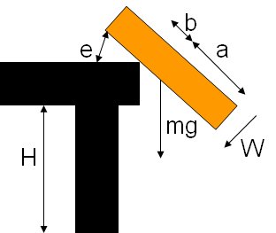

> Текст был взят с wiki-страницы: [Бутерброд](https://ru.wikipedia.org/wiki/Бутерброд) и отформатирован в markdown
>> Дата: 04.03.2001
---
```ruby
require 'redcarpet'
markdown = Redcarpet.new("Hello World!")
puts markdown.to_html
```
---
# Бутерброд
**Бутербро́д** (от [нем.](https://ru.wikipedia.org/wiki/Немецкий_язык) Butterbrot - [хлеб](https://ru.wikipedia.org/wiki/Хлеб) [с маслом](https://ru.wikipedia.org/wiki/Сливочное_масло)) - [закуска](https://ru.wikipedia.org/wiki/Закуска), представляющая собой ломтик хлеба или [булки](https://ru.wikipedia.org/wiki/Хлебобулочное_изделие), на который положены дополнительные пищевые продукты [1]. Существует огромное количество видов бутербродов - от классических с [колбасой](https://ru.wikipedia.org/wiki/Колбаса) или [сыром](https://ru.wikipedia.org/wiki/Сыр) до многослойных из различных сортов мяса, овощей, зелени и соусов или паштетов. Также бутерброд может состоять только из хлеба и сливочного масла, возможно с сахаром, вареньем, мёдом или солью. [Сэндвич](https://ru.wikipedia.org/wiki/Сэндвич) - бутерброд, состоящий из двух и более кусков хлеба. Бутерброды широко распространены, так как они быстры в приготовлении, удобны в переноске и [не требуют использования приборов](https://ru.wikipedia.org/wiki/Еда,_употребляемая_руками).

Самый распространённый вид бутербродов - ломтик хлеба или булки с каким-либо из закусочных продуктов (сыром, [ветчиной](https://ru.wikipedia.org/wiki/Бутерброд_с_ветчиной), колбасой, икрой, мясом, рыбой, консервами). Оформлять их можно листовыми и пряными овощами, кусочками яйца и лимона, маслинами, соусом, майонезом с корнишонами и др. Подаются бутерброды на блюдах, в вазах с плоскими краями или на тарелках, покрытых салфетками. Бутерброды не подлежат длительному хранению, поэтому их готовят непосредственно перед подачей на стол.

## Ингредиенты
Часто используемые при приготовлении бутербродов ингредиенты:
* [пшеничный](https://ru.wikipedia.org/wiki/Пшеница) или [ржаной хлеб](https://ru.wikipedia.org/wiki/Ржаной_хлеб)
* молочные продукты - [сыры](https://ru.wikipedia.org/wiki/Сыр), [сливочное масло](https://ru.wikipedia.org/wiki/Сливочное_масло) и его заменители ([маргарин](https://ru.wikipedia.org/wiki/Маргарин), [спред](https://ru.wikipedia.org/wiki/Спред_(жировой_продукт)))
* мясные продукты - [колбасы](https://ru.wikipedia.org/wiki/Колбаса), [ветчина](https://ru.wikipedia.org/wiki/Ветчина), [варёное](https://ru.wikipedia.org/wiki/Приёмы_приготовления_пищи) или [жареное](https://ru.wikipedia.org/wiki/Жаренье) [мясо](https://ru.wikipedia.org/wiki/Мясо), [сало](https://ru.wikipedia.org/wiki/Сало)
* рыбные продукты - [осетрина](https://ru.wikipedia.org/wiki/Осетры), солёная [сельдь](https://ru.wikipedia.org/wiki/Сельди), [икра](https://ru.wikipedia.org/wiki/Икра_(кулинария)), [рыбные](https://ru.wikipedia.org/wiki/Рыбы) [консервы](https://ru.wikipedia.org/wiki/Консервы)
* овощи - [томаты](https://ru.wikipedia.org/wiki/Томат), [огурцы](https://ru.wikipedia.org/wiki/Огурец_обыкновенный), [лук](https://ru.wikipedia.org/wiki/Лук_репчатый), [салат](https://ru.wikipedia.org/wiki/Латук), [паприка](https://ru.wikipedia.org/wiki/Капсикум)
* соусы - [майонез](https://ru.wikipedia.org/wiki/Майонез), [кетчуп](https://ru.wikipedia.org/wiki/Кетчуп), [горчица](https://ru.wikipedia.org/wiki/Горчица_(приправа))
* зелень - [укроп](https://ru.wikipedia.org/wiki/Укроп), [петрушка](https://ru.wikipedia.org/wiki/Петрушка_(растение)), [кинза](https://ru.wikipedia.org/wiki/Кориандр), [базилик](https://ru.wikipedia.org/wiki/Базилик)
* пасты - [брынза](https://ru.wikipedia.org/wiki/Брынза), [сыр](https://ru.wikipedia.org/wiki/Сыр) и [творог](https://ru.wikipedia.org/wiki/Творог)

## Разновидности бутербродов

Бутерброд | Изображение
------------ | -------------
Бутерброд с [красной икрой](https://ru.wikipedia.org/wiki/Красная_икра) | 
Бутерброд с [брынзой](https://ru.wikipedia.org/wiki/Брынза) | 
Бутерброд с [помидорами](https://ru.wikipedia.org/wiki/Томат) и [шпротами](ru.wikipedia.org/wiki/Шпроты_(консервы)) | 
[Бутерброд с ветчиной](https://ru.wikipedia.org/wiki/Бутерброд_с_ветчиной) | 

Пример горячего бутерброда
В кулинарии бутерброды делятся на открытые и закрытые, которые в свою очередь получили название «сэндвич» (сандвич), а также маленькие бутерброды на поджаренном хлебе - «канапе» (канапэ) и «тартинки».

### Горячие бутерброды
См.: [Тартинка](https://ru.wikipedia.org/wiki/Тартинка).


Горячие бутерброды разогревают в процессе приготовления и употребляют, как правило, в горячем виде. Их начинка обычно накрывается кусочком сыра, и бутерброд нагревается до его плавления. Также для украшения бутерброда можно использовать различные травы: [петрушку](https://ru.wikipedia.org/wiki/Петрушка_(растение)), [салат](https://ru.wikipedia.org/wiki/Латук), [укроп](https://ru.wikipedia.org/wiki/Укроп) и т.д.

## Необычные бутерброды
Самый большой бутерброд в мире длиной 720 [метров](https://ru.wikipedia.org/wiki/Метр) был изготовлен семьюстами жителями [ливанской](https://ru.wikipedia.org/wiki/Ливан) деревни Кфар Катра.[2]
В России самый большой по площади бутерброд был изготовлен на [Нижегородской](https://ru.wikipedia.org/wiki/Нижний_Новгород) ярмарке. Его площадь составила 14 м². Над проектом работали сотрудники нижегородского масложирового комбината. Работа была посвящена 780-летию города. Бутерброд состоял из следующих ингредиентов: 45 пшеничных коржей, шесть видов майонеза, колбаса, сыр и овощи[3].
Сеть супермаркетов «[Tesco](https://ru.wikipedia.org/wiki/Tesco)» выпустила музыкальные бутерброды, которые играют рождественские мелодии после того, как их вынимают из упаковки.
Самый длинный в Российской Федерации бутерброд был изготовлен 27 июля 2010 года в [Северодвинске](https://ru.wikipedia.org/wiki/Северодвинск); его длина составила 44 метра 77 сантиметров[4].
Надкусанный бутерброд с сыром, на котором вырисовывается силуэт Девы Марии, был продан на аукционе за 28 тыс. долларов. Возраст бутерброда на момент продажи составил 10 лет[5].

## Бутерброд в искусстве
[А.А.Милн](https://ru.wikipedia.org/wiki/Милн,_Алан_Александр) написал «Балладу о королевском бутерброде» (известна в переводе [С.Я.Маршака](https://ru.wikipedia.org/wiki/Маршак,_Самуил_Яковлевич)[6]).

В сентябре 2011 года в Москве прошла Первая Московская Биеннале Бутербродного Искусства, участие в которой приняли [Александр Флоренский](https://ru.wikipedia.org/wiki/Флоренский,_Александр_Олегович), [Андрей Бильжо](https://ru.wikipedia.org/wiki/Бильжо,_Андрей_Георгиевич), «[Синие носы](https://ru.wikipedia.org/wiki/Синие_носы)» и другие российские художники[7].

## Юмор
«По-немецки - цацки-пецки, а по-русски - бутерброд» (фраза из кинофильма «[Республика ШКИД](https://ru.wikipedia.org/wiki/Республика_ШКИД_(фильм))»).
[Быстро поднятое упавшим не считается.](https://ru.wikipedia.org/wiki/Правило_пяти_секунд)
### Закон бутерброда
Частным случаем [закона Мерфи](https://ru.wikipedia.org/wiki/Закон_Мерфи) является «закон бутерброда», гласящий: «Бутерброд всегда падает маслом вниз»[8], или, в другой интерпретации, «Вероятность падения бутерброда маслом вниз прямо пропорциональна стоимости ковра».
#### Следствия
Если бутерброд намазать маслом с двух сторон, то после падения он начнёт кататься по ковру.
Противники предыдущей точки зрения считают, что если бутерброд намазать маслом с двух сторон (а лучше - со всех шести), то он зависнет в воздухе.
#### Проверки
Полушутливое утверждение, что бутерброд практически всегда падает намазанной частью вниз, не лишено некоторых оснований:

Смещение [центра тяжести](https://ru.wikipedia.org/wiki/Центр_масс) бутерброда к той стороне, на которой лежит масло.
Возможное объяснение: если бутерброд упадёт хлебом вниз, то он может отскочить и перевернуться.
И, наконец, психологический эффект: падение бутерброда намазанной стороной вниз вызывает больше [негативных эмоций](https://ru.wikipedia.org/wiki/Эмоция) и, следовательно, лучше откладывается в памяти.
Практическая проверка проводилась в американской телепередаче «[Разрушители легенд](https://ru.wikipedia.org/wiki/Разрушители_легенд)», проверяемый миф назывался «Toast - Butter Side Up or Down?». В результате проверки выяснилось, что, будучи сброшенным идеально вертикально, бутерброд с маслом может равновероятно упасть как на одну, так и на другую сторону (фактически, бутерброды падали чаще на сторону без масла, так как в процессе намазывания маслом приобретали слегка изогнутую форму). Однако если столкнуть бутерброд с края стола (типичная бытовая ситуация), то он обычно делает пол-оборота в воздухе и падает именно маслом вниз. Следует заметить, что разрушители легенд испытывали в качестве бутерброда горячие [тосты](https://ru.wikipedia.org/wiki/Тостовый_хлеб), смазанные мизерным (на кончике ножа) количеством масла.

В фильме «QED» ([BBC](https://ru.wikipedia.org/wiki/Би-би-си), 1991) были поставлены многочисленные эксперименты, опровергающие распространённое мнение. В ходе опыта было подброшено 300 бутербродов, из которых 148 упали маслом вверх, что приблизительно равняется теоретической вероятности в 50 %.[9]

В 1996 году физик Роберт Мэттьюз из университета Эстона (Англия) получил [Шнобелевскую премию](https://ru.wikipedia.org/wiki/Шнобелевская_премия) за работу «Падающий бутерброд, закон Мерфи и мировые постоянные», посвящённую тщательному исследованию данного [Закона Мерфи](https://ru.wikipedia.org/wiki/Закон_Мерфи) и особенно проверке его следствия: бутерброд чаще падает на землю маслом вниз.

Мэттьюз вывел формулу для обоснования своих доводов.

-   - угловая скорость вращения
-  - половина длины бутерброда
-  - критическое нависание
-  - высота стола
-  - угол отрыва от стола
-  - вес бутерброда
-  - параметр переворачивания, n = b/a

Динамика бутерброда|
------------ |
|


## См. также
- [Кростини](https://ru.wikipedia.org/wiki/Кростини)
- [Брускетта](https://ru.wikipedia.org/wiki/Брускетта)
- [Крок-месье](https://ru.wikipedia.org/wiki/Крок-месье)
- [Парадокс кошки с маслом](https://ru.wikipedia.org/wiki/Парадокс_кошки_с_маслом)
- [Капрезе](https://ru.wikipedia.org/wiki/Капрезе) - нечто среднее между [салатом](https://ru.wikipedia.org/wiki/Салат_(блюдо)) и бутербродом («бутерброд» с маслом и сыром, в котором вместо хлеба лежит помидор, а масло оливковое)
- [Смёрребрёд](https://ru.wikipedia.org/wiki/Смёрребрёд)
- [Гамбургер](https://ru.wikipedia.org/wiki/Гамбургер)
- [Сэндвич](https://ru.wikipedia.org/wiki/Сэндвич)

## Примечания
1. [Бутерброд](https://ru.wikisource.org/wiki/МЭСБЕ/Бутерброд) // [Малый энциклопедический словарь Брокгауза и Ефрона](https://ru.wikipedia.org/wiki/Энциклопедический_словарь_Брокгауза_и_Ефрона) : в 4 т. - СПб., 1907-1909.
1. [Приготовлен самый большой бутерброд в мире](https://kuking.net/19_384.htm) // kuking.net
1. [В Нижнем съели самый большой в России бутерброд](https://www.gotovim.ru/library/records/bigbutter.shtml) // Готовим. РУ
1. [В Северодвинске сделали самый длинный бутерброд в России](http://www.dvinainform.ru/news/2010/07/27/85911.shtml)
1. [Надкусанный бутерброд с образом Девы Марии продан за 28 тысяч долларов.](https://lenta.ru/internet/2004/11/23/mary/) [Lenta.ru](https://ru.wikipedia.org/wiki/Lenta.ru) (23 ноября 2004). Дата обращения: 13 августа 2010.
1. Алан Александр Милн. [Баллада о королевском бутерброде](http://lib.ru/MILN/r_buterbrod.txt)
1. [Первая Биеннале Бутербродного Искусства](https://antiquesalon.ru/2169.html). ЭКСПО-ПАРК выставочные проекты. Дата обращения: 12 сентября 2011. [Архивировано](https://web.archive.org/web/20111006064227/http://www.art-moscow.ru/2169.html) 6 октября 2011 года.
1. [Статья «Закон бутерброда» в журнале «Знание - сила»](http://www.znanie-sila.ru/news/issue_125.html)
1. [Murphy’s Law - Part 3 › In Depth (ABC Science)](http://www.abc.net.au/science/k2/moments/s42137.htm)
 
## Литература
- Бутерброды // Товарный словарь / И. А. Пугачёв (главный редактор). - М.: Государственное издательство торговой литературы, 1956. - Т. I. - Стб. 691-695
- [Бутерброды](https://kulinaria1955.ru/holodnye_i_goryachie_zakuski/holodnye_zakuski/buterbrody/) // Кулинария / Гл. ред. М.О. Лифшиц. - М.: Госторгиздат, 1955. - С. 140-143. - 960 с.
